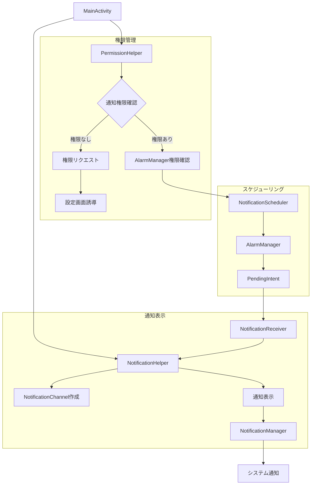
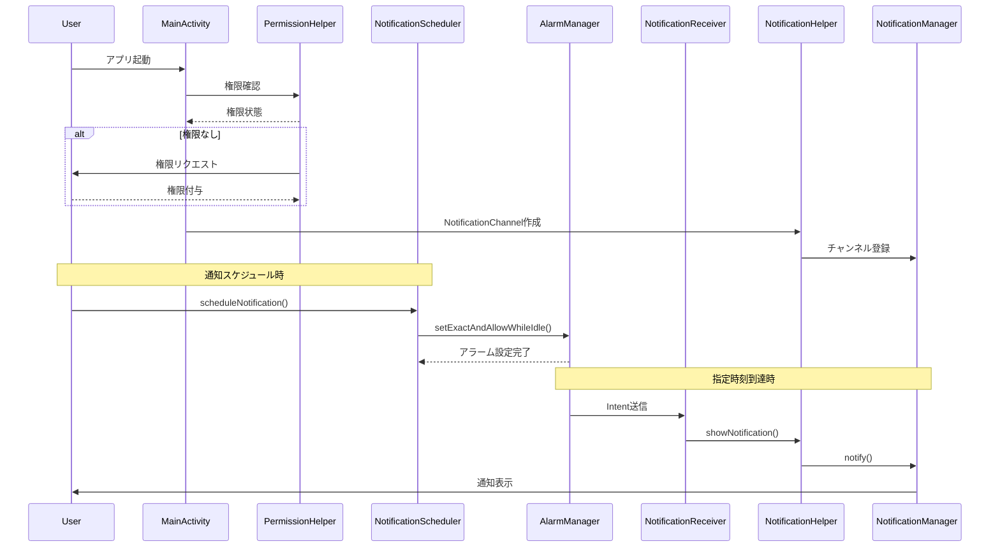

# ローカルプッシュ通知実装ドキュメント

## 概要

このプロジェクトでは、Androidアプリにローカルプッシュ通知機能を実装しました。AlarmManagerを使用してスケジュールされた通知を表示し、Android 8.0+のNotificationChannelとAndroid 13+の通知権限に対応しています。

## アーキテクチャ図



## コンポーネント詳細

### 1. MainActivity
- アプリケーションのエントリーポイント
- 起動時に通知権限とアラーム権限を確認
- NotificationChannelの初期化を実行

### 2. PermissionHelper
通知とアラーム関連の権限管理を担当：
- `POST_NOTIFICATIONS`権限（Android 13+）
- `SCHEDULE_EXACT_ALARM`権限（Android 12+）
- 権限リクエストと設定画面への誘導

### 3. NotificationHelper
通知の作成と表示を管理：
- NotificationChannelの作成（Android 8.0+対応）
- NotificationCompat.Builderを使用した通知構築
- BigTextスタイルとPendingIntentの設定

### 4. NotificationScheduler
AlarmManagerを使用したスケジューリング：
- `setExactAndAllowWhileIdle()`による正確なアラーム
- バッテリー最適化対応
- 繰り返し通知のサポート
- 通知のキャンセル機能

### 5. NotificationReceiver
BroadcastReceiverによる通知トリガー：
- アラームイベントの受信
- 通知データの抽出
- NotificationHelperへの通知表示委譲

## データフロー



## 主要ファイル

### NotificationHelper.kt
```kotlin
// 通知チャンネル作成とNotificationCompat.Builderによる通知表示
// Android 8.0+対応、BigTextスタイル、PendingIntent設定
```

### NotificationScheduler.kt
```kotlin
// AlarmManagerによるスケジューリング
// setExactAndAllowWhileIdle()、繰り返し通知、キャンセル機能
```

### NotificationReceiver.kt
```kotlin
// BroadcastReceiverによる通知トリガー
// Intent extraからデータ取得、NotificationHelper呼び出し
```

### PermissionHelper.kt
```kotlin
// 権限管理：POST_NOTIFICATIONS、SCHEDULE_EXACT_ALARM
// 権限確認、リクエスト、設定画面誘導
```

## Android版本対応

### Android 8.0 (API 26)+
- NotificationChannelの使用が必須
- チャンネルの重要度設定による通知制御

### Android 12 (API 31)+
- `SCHEDULE_EXACT_ALARM`権限が必要
- `canScheduleExactAlarms()`による権限確認

### Android 13 (API 33)+
- `POST_NOTIFICATIONS`がランタイム権限に変更
- ユーザーの明示的な許可が必要

## セキュリティ考慮事項

- PendingIntentに`FLAG_IMMUTABLE`フラグを使用
- BroadcastReceiverは`exported="false"`で外部アクセス防止
- 権限拒否時の適切なフォールバック処理

## 使用例

```kotlin
// 5分後に通知をスケジュール
val futureTime = System.currentTimeMillis() + (5 * 60 * 1000)
NotificationScheduler.scheduleNotification(
    context = this,
    notificationId = 1,
    title = "リマインダー",
    content = "予定の時間です",
    timeInMillis = futureTime
)
```

## 制限事項

- バッテリー最適化の影響でアラームが遅延する可能性
- デバイスの省電力モードでは通知が制限される場合がある
- ユーザーが通知権限を拒否した場合、通知は表示されない